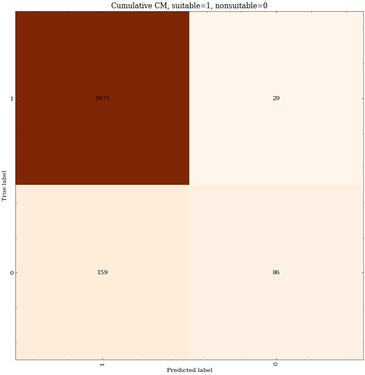

# Addendum 2021-11-22T14:15:59

The CLARIN repo was pulled anew to get the non-suitable dataset. Dataset construction will begin by reading all of the data, regardless of the duplicate flag.

I shall open a new notebook for this, namely 25_suitable_dataset_construction.

I note there are 1002 suitable documents and only 123 nonsuitable. Data has been saved as `/home/peterr/macocu/task5_webgenres/data/interim/suitable_tabular.csv`.


# Addendum 2021-11-23T10:10:26

The experiment is finished. 15 runs have been run on full datasets. If all the results are reshaped into a single matrix, the following figure is obtained:



If f1_score is calculated across all runs and then averaged, we get **f1 = 0.954 +/- 0.0029**

### Comparison with dummy classifier

Due to enormous class imbalance we really should include a dummy classifer for comparison.

```
Dummy clf: strategy: 'stratified', 0.887 +/- 0.0105
Dummy clf: strategy: 'most_frequent', 0.942 +/- 0.0
```

### Are we better than dummy?

As before a MannWhitney U-test was used to estimate p-value. We get:
```
Dummy clf: strategy: 'stratified', 0.894 +/- 0.00945
	 p_value: 1.69e-06
Dummy clf: strategy: 'most_frequent', 0.942 +/- 0.0
	 p_value: 3.41e-07
```
Note: `stratified` strategy is stochastic, so the results are different from the results above, but they are within 1-sigma from eachother.


## Verdict

Our classifier is statistically significantly better than guessing, but unfortunately it is _only statistically_ significantly better than guessing.