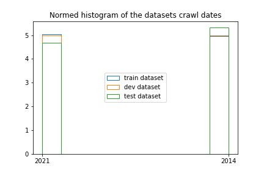
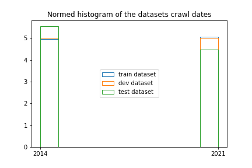
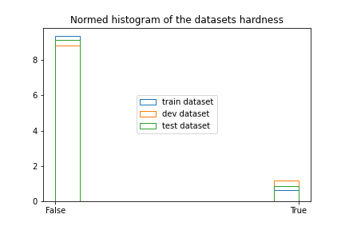
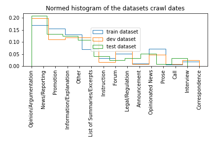
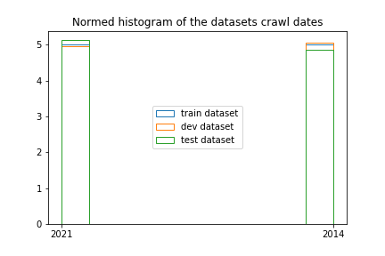
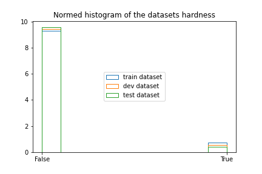
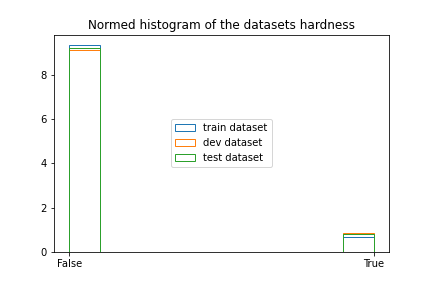
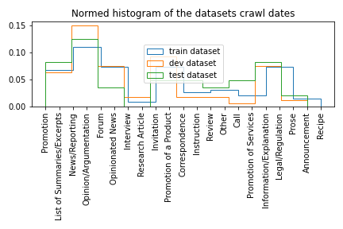
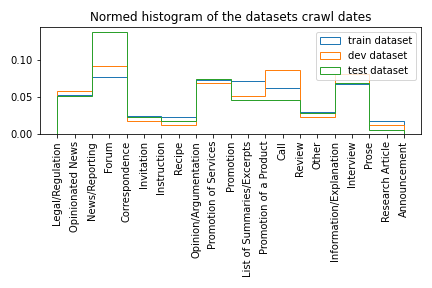

# task5_webgenres

**
For logs of actual ML experiments take a look at EXPERIMENTS_LOG.md.**

## Data preparation

I performed the splitting into train, dev and test splits, as documented in `1_data_preparation.ipynb`. In this step I only took into account stratification by year. It turns out that the ratios of hardness is preserved in this case, but the ratios of primary labels across folds is not preserved as much as we would perhaps hope. I attempt to correct this in `1a_data_preparation.ipynb`. I tried to split it by stratifying crawl year, primary labels and hardness, but it turned out that this is not possible, as some combinations of these parameters only had one instance.

I therefore discarded hardness from the stratification process and opted only for crawl date and primary label. I performed the same data leakage corrections as before. Below I'm presenting a few distributions for both scenarios:

### Crawl date:

Original:

After including primary labels:

### Hardness:

Original: 

After including primary labels:

### Primary labels:

Original:

After including primary labels:

As we can see, the distribution of the primary labels has changed more with the inclusion of the primary label in the stratification algorithm. I therefore propose that further experiments be done with the first dataset created.

# Downsampling corrections:

Label downsampling has previously been done incorectly, as only the first dictionary is to be included at this point. This has been corrected, but the resulting data is still preserved.

The resulting crawl date, hardness and primary label distributions are as follows:

### Crawl date:

Original:

After including primary labels:

### Hardness:

Original: 

After including primary labels:

### Primary labels:

Original:

After including primary labels:

In the next iteration I discarded the idea of correcting domain-based data leakage between dev and test splits to try and improve the primary label distributions between splits. The final iteration looks like this:

# Filename tracking

|filename|description|origin for|
|---|---|---|
|tabular.csv|first attempt with incorrect downsampling|dev.csv, train.csv, test.csv|
|tabular_1a.csv|incorrect downsampling, added year, primary and hardness to stratification, didn't work|dev_1a.csv, train_1a.csv, test_1a.csv|
|tabular_1b.csv|incorrect downsampling, added year and primary to stratification,works|dev_1b.csv, train_1b.csv, test_1b.csv|
|tabular_2.csv|correct downsampling|dev_2.csv, train_2.csv, test_2.csv|
|tabular_2b.csv|correct downsampling, stratification on year and primary|dev_2b.csv, train_2b.csv, test_2b.csv|
|tabular_2c.csv|correct downsampling, stratification on primary|dev_2c.csv, train_2c.csv, test_2c.csv|